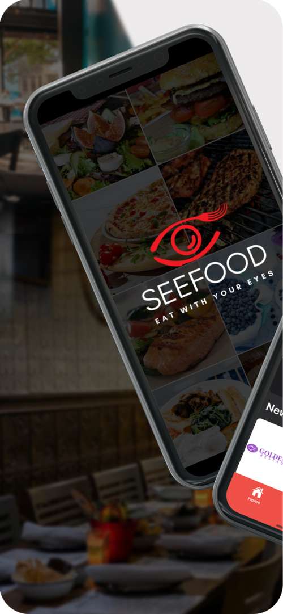
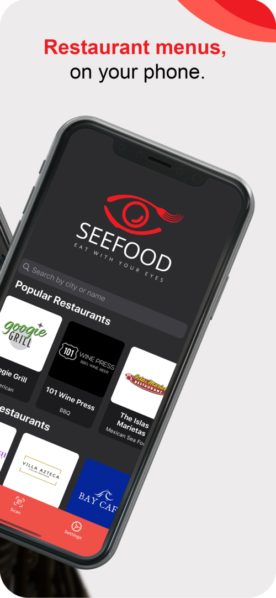
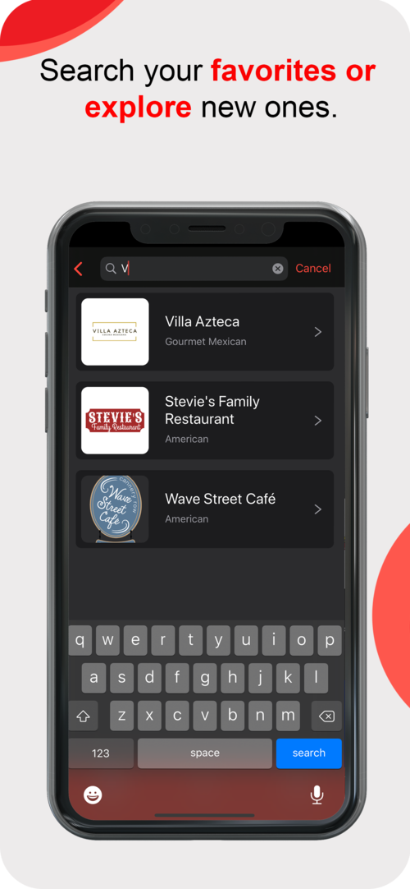
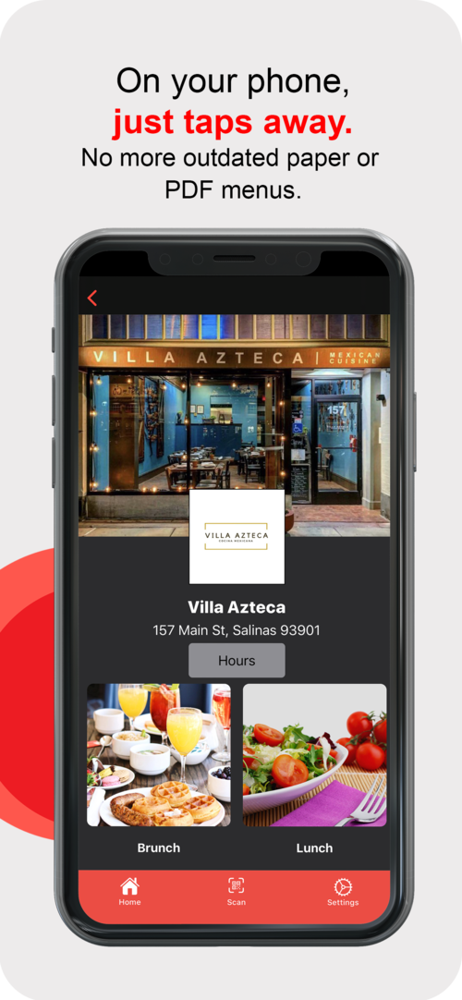
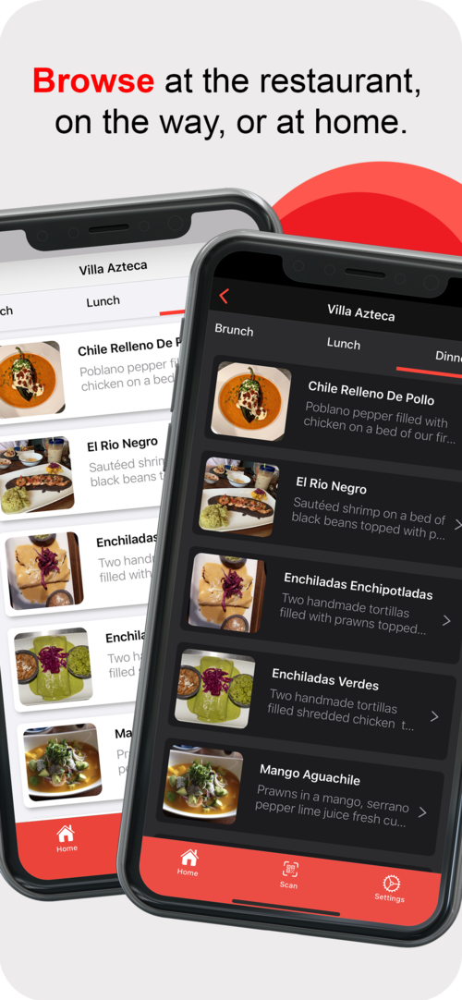
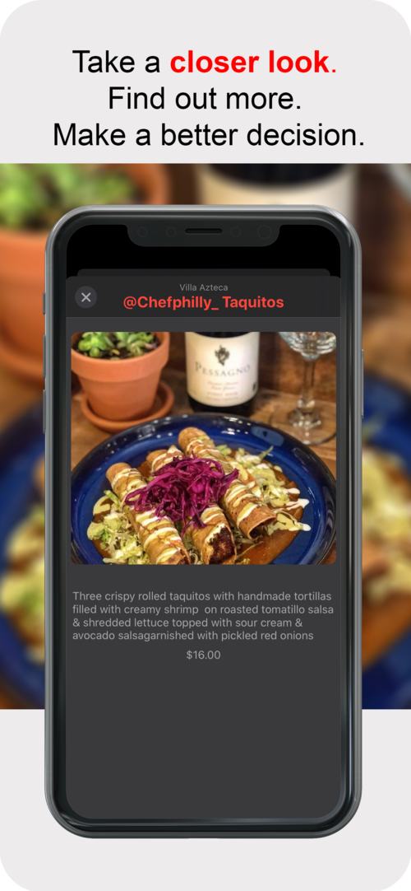

# SeeFood - Eat With Your Eyes
     

```
Stay safe and stay clean. Use SeeFood to avoid physical menus when dining out. 
View restaurant menus from the comfort of your own device.
```

SeeFood lets you eat with your eyes. Explore and browse visual menus from your favorite local restaurants.

**YOUR FAVORITE MENUS JUST TAPS AWAY-**
Find your favorite menus quickly. No more searching multiple websites, downloading PDF's or zooming in on small pictures of menus form review sites.

**AT THE RESTAURANT, AT HOME OR ON THE WAY-**
 - At the restaurant- use SeeFood to quickly browse the menu, see pictures of dishes and get more information about dishes that the menu may not offer!
 - At home- use SeeFood to browse menus before ordering food for pick-up or delivery!
 - On the way- use SeeFood to browse menus before you arrive at the restaurant and be better prepared to order when you arrive!

## ABOUT SEEFOOD
SeeFood is a technology company that connects people and restaurants. We do this by empowering local restaurants to showcase their menus and dishes on our platform and in turn, give their customers and guests a better dinning experience.
Growing every day, we currently focus and serve the Monterey Bay Area. We are adding new restaurant partners and menus weekly.


<a href="http://codecrunch.io/" target="_blank"></a>
